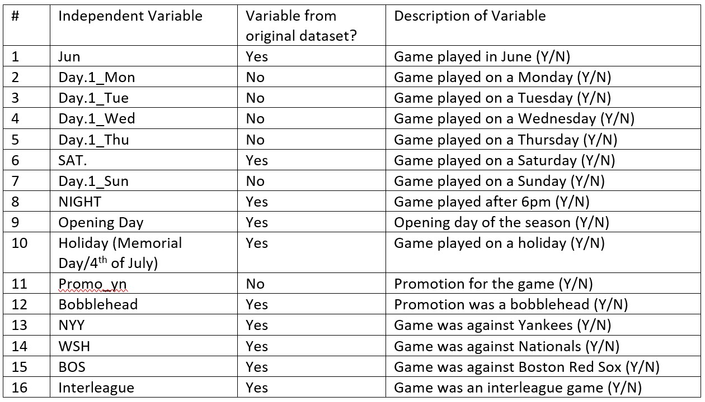

# Orioles Attendance Prediction – Model Card

### Basic Information

* **Persons involved in developing model**: Yasir Mohammad - `yasir@gwu.edu`
* **Model date**: November, 2021
* **Model version**: 1.0
* **License**: MIT License
* **Model implementation code**:
  * **Model**: (Orioles_Prediction_Model_v1.0.ipynb)

### Intended Use
* **Primary intended uses**: This model is intended to predict attendance for 2022 home games played by the Baltimore Orioles

### Data Source & Data Dictionary
* INSERT LINK HERE
* **How data was split into training and test data**: 80% training, 20% test

### Model Details
* **Columns used as inputs in the final model**: 

*	**Columns used as targets in the final model**: ATTENDANCE
* **Type of Model**: Multiple Regression
*	**Software used to train the Model**: Python v3.8.8
*	**Metrics used to evaluate the model and final figures**:
  * **R Squared**: 0.923
  * **Adjusted R Squared**: 0.919

### Data Visualizations

